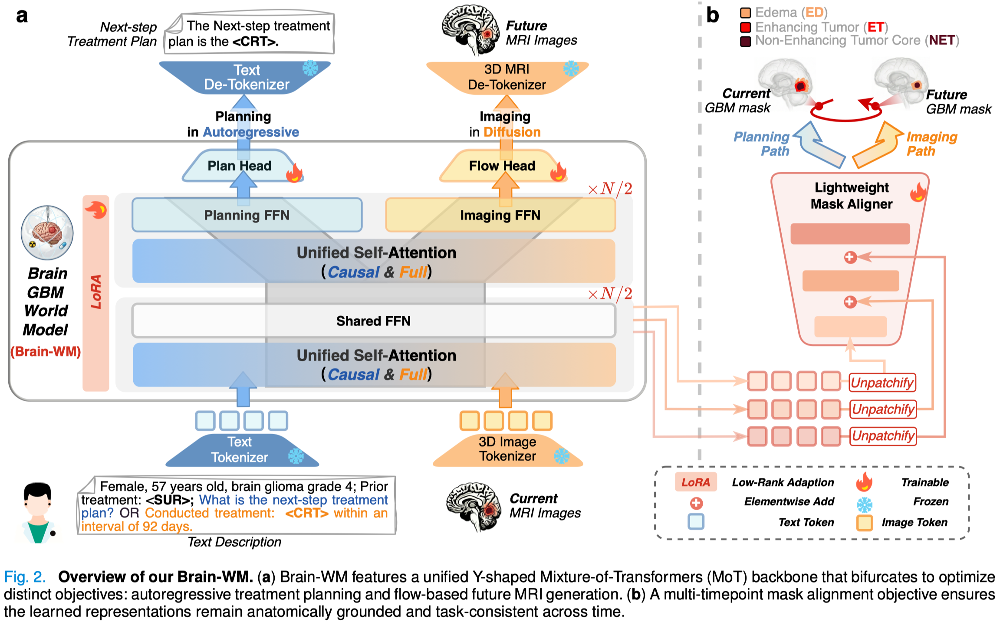

# Brain-WM: Brain Glioblastoma World Model


This is the official repository for **Brain-WM: Brain Glioblastoma World Model**. 

## 📖 Overview

To bridge the gap between prognostic simulation and active clinical planning in glioblastoma (GBM) management, we present **Brain-WM**, a brain GBM world model that jointly enables next-step treatment planning and future MRI generation. 

Unlike traditional models that treat interventions as static inputs, Brain-WM establishes a synergistic feedback loop: simulated tumor evolution informs treatment formulation, while treatment intent constrains biologically plausible progression. Validated across multi-centric cohorts, Brain-WM offers a robust clinical sandbox for optimizing decision-making and patient healthcare.

<p align="center"> </p>

## ✨ Key Contributions

* **Unified Framework**: Encodes tumor spatiotemporal dynamics for joint autoregressive treatment prediction and flow-based future MRI generation.
* **Y-shaped MoT Architecture**: A novel Y-shaped Mixture-of-Transformers (MoT) architecture that structurally disentangles heterogeneous objectives to leverage cross-task synergies while preventing feature collapse.
* **Multi-timepoint Mask Alignment**: Anchors latent representations to anatomically grounded tumor structures and progression-aware semantics.
## 📊 Datasets

Brain-WM was systematically validated across multi-centric cohorts. 
* **Internal Cohort**: Aggregated from three public datasets: LUMIERE, MU-Glioma Post, and UCSF-ALPTDG.
* **External Validation Cohort**: Evaluated on an independent validation cohort from the RHUH-GBM and UCSD-PTGBM datasets.

*Note: Due to data privacy regulations, users must independently request access to these public datasets via their respective institutional portals.*

## 💻 Getting Started

### Prerequisites
The codebase is built using Python, relying heavily on `torch` for deep learning modeling and `monai` for volumetric medical image array manipulations.

```bash
# Clone the repository
git clone [https://github.com/thibault-wch/Brain-GBM-world-model.git](https://github.com/thibault-wch/Brain-GBM-world-model.git)
cd Brain-GBM-world-model

# Create and activate a conda environment
conda create -n brainwm python=3.10.18
conda activate brainwm


# Install requirements
pip install -r requirements.txt
```

## Acknowledgments
This work is heavily based on [taming-transformers](https://github.com/CompVis/taming-transformers), [transformers](https://github.com/huggingface/transformers), [accelerate](https://github.com/huggingface/accelerate), [diffusers](https://github.com/huggingface/diffusers), [Show-o](https://github.com/showlab/Show-o/), and [Show-o2](https://github.com/showlab/Show-o/tree/main/show-o2). Thanks to all the authors for their great work.